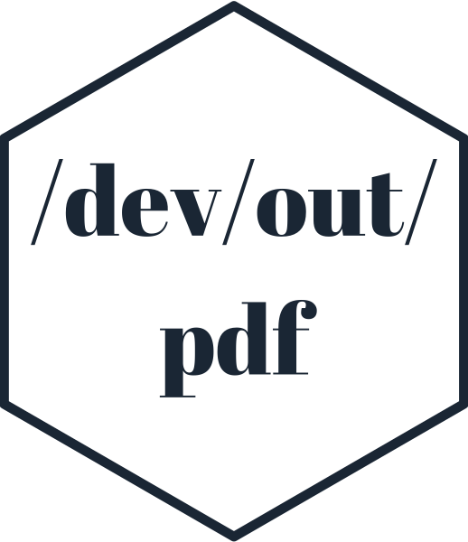
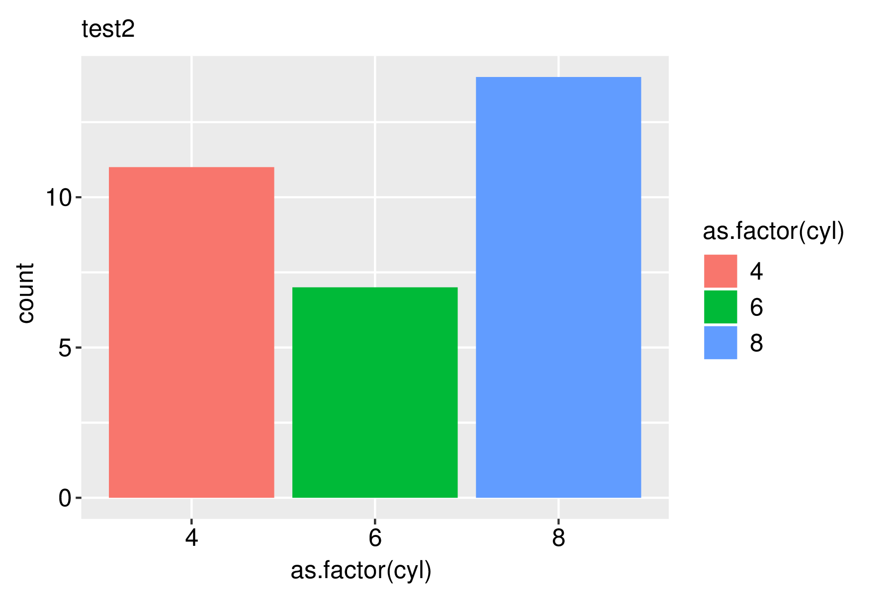
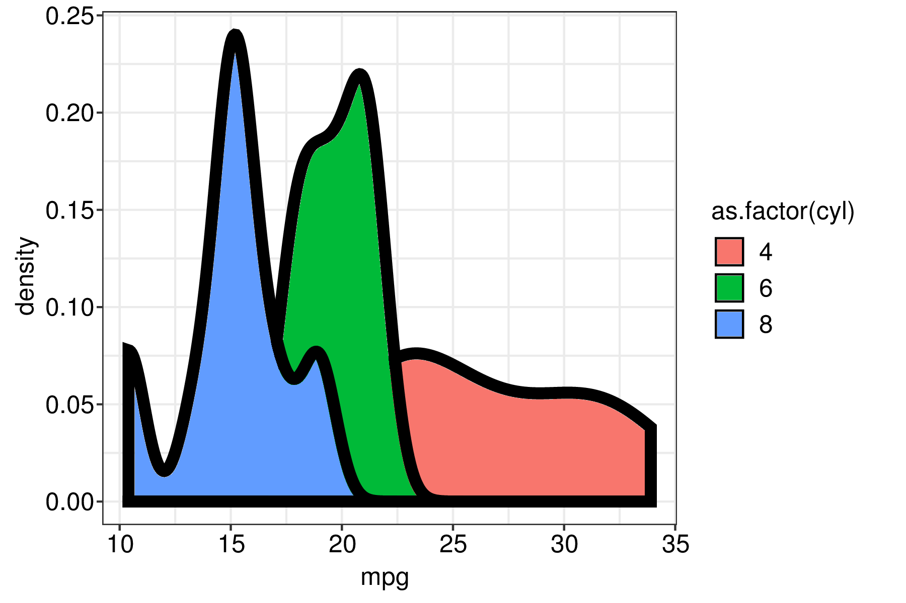
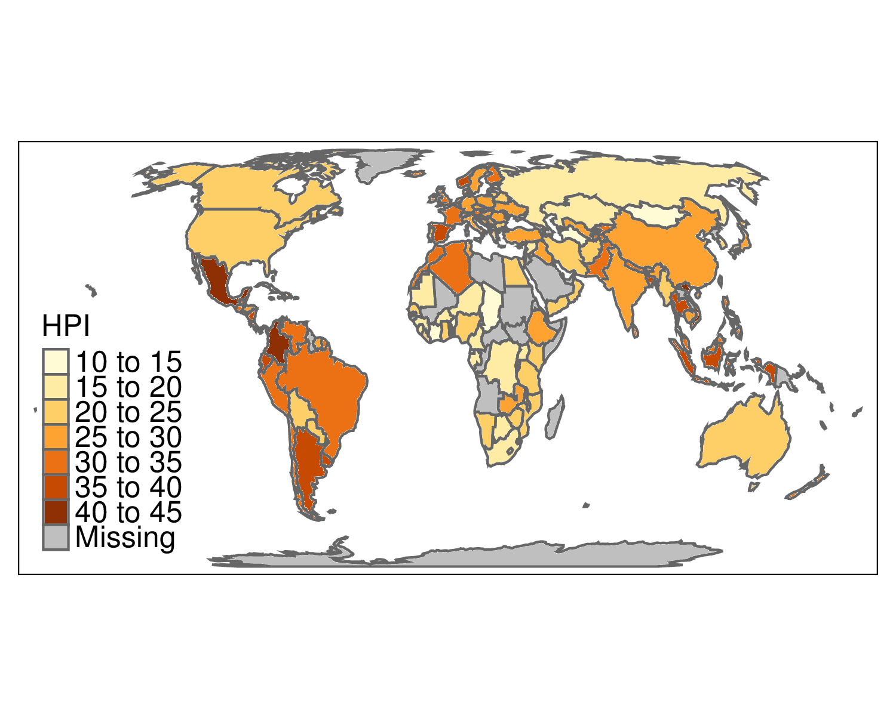
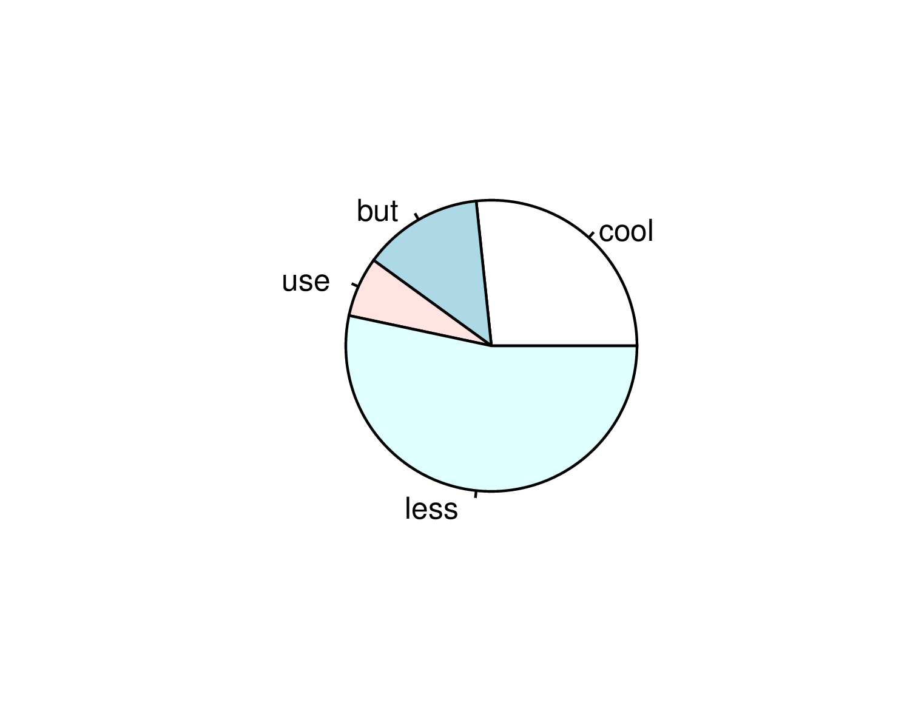

<!-- README.md is generated from README.Rmd. Please edit that file -->

# devoutpdf 

<!-- badges: start -->


 [](https://travis-ci.org/coolbutuseless/devoutpdf)
<!-- badges: end -->

`devoutpdf` is a hand-crafted PDF graphics device written in plain R.

It achieves this by invoking the
[`devout`](https://github.com/coolbutuseless/devout) package to do all
the interfacing between the C++ side and the R side.

Drawing commands which sent to the graphics device are used to construct
a [`minipdf`](https://github.com/coolbutuseless/minipdf) document.

### Why would you want this?

Given that `pdf()` and `cairo_pdf()` devices come with R, what’s the
point of a third PDF output device?

  - Hacking your own graphics device gives a significant amount of
    control over the actual output
  - You can learn how a graphics device works - it’s just R, so there’s
    no C++ code to sift through.
  - Use as a template to write your own graphics device for something
    bespoke e.g.  pen plotter output or a laser projection driver\!
  - Glitch the output at the device level e.g. for each line, perhaps
    draw multiple overlapping lines with randomly jittered endpoints to
    simulate a ‘pencil sketch’ effect.

### The R code

The R code for this device is a single file about 300 lines long - most
of which is whitespace and comments. Check it out [on
github](https://github.com/coolbutuseless/devoutpdf-prep/blob/master/R/pdfout.R)

### ToDo

  - Helvetica font is currently used regardless of what the user
    specifies. This is a deficiency that first needs to be fixed in
    `minipdf`.

## Installation

You can install from
[GitHub](https://github.com/coolbutuseless/devoutpdf) with:

``` r
# install.packages("devtools")
devtools::install_github("coolbutuseless/devout")    # graphics device shim
devtools::install_github("coolbutuseless/minipdf")   # PDF document builder
devtools::install_github("coolbutuseless/devoutpdf") # Devout PDF graphics device
```

## Example: ggplot scatterplot

``` r
devoutpdf::pdfout(filename = "man/figures/test1.pdf", width=5, height=4)
ggplot(mtcars) + 
  geom_point(aes(mpg, wt)) + 
  labs(title = "test1") + 
  theme_bw()
invisible(dev.off())
```


## Example: ggplot bar plot

``` r
devoutpdf::pdfout(filename = "man/figures/test2.pdf", width = 6, height = 4)
ggplot(mtcars) + 
  geom_bar(aes(as.factor(cyl), fill = as.factor(cyl))) + 
  labs(title = "test2")
invisible(dev.off())
```



## Example: ggplot density plot

``` r
devoutpdf::pdfout(filename = "man/figures/test3.pdf", width = 6, height = 4)
ggplot(mtcars) + 
  geom_density(aes(mpg, fill = as.factor(cyl)), alpha = 1, size = 2) +
  theme_bw()
invisible(dev.off())
```



## Example: tmap world plot

``` r
library(tmap)
data("World")

devoutpdf::pdfout(filename = "man/figures/test4.pdf", width = 5, height = 4)
tm_shape(World) +
    tm_polygons("HPI")
invisible(dev.off())
```



## Example: base graphics pie chart

``` r
devoutpdf::pdfout(filename = "man/figures/test5.pdf", width = 5, height = 4)
pie(c(cool = 4, but = 2, use = 1, less = 8))
invisible(dev.off())
```


